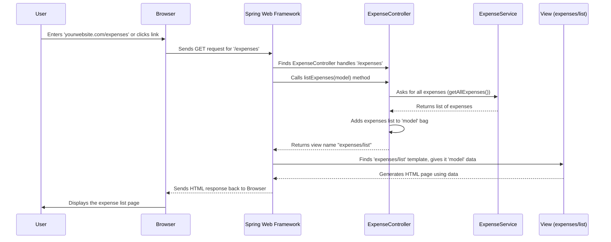

# Chapter 1: Web Request Handler (Controller)

Welcome to the Budget Tracer project! We're building a web application to help you keep track of your expenses. Think of a web application like a helpful assistant you interact with through your web browser (like Chrome, Firefox, or Safari).

But how does the application know what to do when you click a button or visit a specific page? That's where our first key component comes in: the **Web Request Handler**, also known as the **Controller**.

## What's the Big Idea? The Traffic Controller

Imagine you walk into a busy office building. You need help with something specific, maybe opening a new account. You don't just wander around opening doors, right? You go to the **receptionist**.

The receptionist listens to your request ("I want to open an account"), figures out which department handles that (the "New Accounts" department), tells that department what you need, gets the necessary information or forms, and then points you to the right room or person.

In our web application, the **Controller** acts exactly like that receptionist or a traffic controller.

*   **Your Browser Request:** When you click a link (like "View All Expenses") or submit a form (like "Add New Expense") in your browser, you're sending a request to our application.
*   **The Controller Listens:** The Controller is always listening for these incoming requests at specific addresses (URLs).
*   **Understanding the Request:** It figures out what you want to do based on the URL and the type of request (e.g., are you just looking, or are you sending new data?).
*   **Coordinating the Work:** It talks to other parts of the application (like the "business logic" part that knows *how* to manage expenses) to get data or perform actions. We'll learn more about this helper, called the [Business Logic (Service)](04_business_logic__service_.md), in Chapter 4.
*   **Sending the Response:** Finally, it decides what the user should see next – usually which web page (HTML view) to display. We'll cover these views in [Chapter 2: User Interface Views (Thymeleaf Templates)](02_user_interface_views__thymeleaf_templates_.md).

**Our Use Case:** Let's say you want to see a list of all the expenses you've already entered. How does the Controller handle this?

## Meet the `ExpenseController`

In our Java code, the component responsible for handling requests related to expenses is called `ExpenseController`. Let's look at a small part of it.

```java
// File: src/main/java/com/expensetracker/controller/ExpenseController.java

package com.expensetracker.controller;

// Imports tell Java where to find tools we need
import org.springframework.stereotype.Controller;
import org.springframework.ui.Model;
import org.springframework.web.bind.annotation.GetMapping;
import org.springframework.web.bind.annotation.RequestMapping;
// ... other imports

import com.expensetracker.service.ExpenseService;

// This annotation tells Spring Framework this is a Controller
@Controller
// This means this controller handles requests starting with "/expenses"
@RequestMapping("/expenses")
public class ExpenseController {

    // We need the ExpenseService to get the actual expense data
    private final ExpenseService expenseService;

    // Constructor: How an ExpenseController is created
    // @Autowired tells Spring to automatically provide the ExpenseService
    public ExpenseController(ExpenseService expenseService) {
        this.expenseService = expenseService;
    }

    // Handles requests to view the main "/expenses" page
    @GetMapping
    public String listExpenses(Model model) {
        // 1. Ask the service for all expenses
        model.addAttribute("expenses", expenseService.getAllExpenses());
        // 2. Prepare an empty expense object for the 'add expense' form
        model.addAttribute("expense", new Expense()); // We'll see Expense in Chapter 3
        // 3. Tell Spring which HTML page (view) to show the user
        return "expenses/list";
    }

    // ... other methods for adding, editing, deleting expenses ...
}
```

**Explanation:**

1.  **`@Controller`:** This is like a sign on the door saying "Reception Desk Here!". It tells the underlying Spring framework (which helps us build web apps) that this class handles web requests.
2.  **`@RequestMapping("/expenses")`:** This specifies the main address or path this controller is responsible for. Any request starting with `http://yourwebsite.com/expenses` will be directed here first.
3.  **`private final ExpenseService expenseService;`**: This declares that our controller needs help from an `ExpenseService`. Think of the `ExpenseService` as the expert department that actually knows how to fetch, save, or delete expense data. We'll learn more about it in [Chapter 4: Business Logic (Service)](04_business_logic__service_.md).
4.  **`public ExpenseController(...)`**: This is the constructor, the instructions for creating an `ExpenseController`. The `@Autowired` annotation is like magic – it tells Spring to automatically find and provide the needed `ExpenseService` instance when creating the controller.
5.  **`@GetMapping`:** This annotation specifies that the `listExpenses` method should handle HTTP GET requests sent to the `/expenses` path (the base path we defined earlier). GET requests are typically used when you just want to *view* data.
6.  **`public String listExpenses(Model model)`:** This is the actual method that runs.
    *   It takes a `Model` object as input. Think of the `Model` as a temporary bag or container where we can put data that we want to show on the web page.
    *   `expenseService.getAllExpenses()`: The controller asks the `ExpenseService` to fetch all the expense records.
    *   `model.addAttribute("expenses", ...)`: The controller takes the list of expenses received from the service and puts it into the `Model` bag, giving it the label "expenses". The web page will later use this label to find and display the data.
    *   `model.addAttribute("expense", new Expense())`: It also adds an empty placeholder for adding a *new* expense later on the same page. The `Expense` object itself is covered in [Chapter 3: Expense Data Model](03_expense_data_model.md).
    *   `return "expenses/list";`: This is crucial! The controller doesn't generate the HTML itself. Instead, it returns the *name* of the template file ("expenses/list") that should be used to create the final HTML page for the user. We'll see this template in [Chapter 2: User Interface Views (Thymeleaf Templates)](02_user_interface_views__thymeleaf_templates_.md).

So, when you navigate to `http://yourwebsite.com/expenses` in your browser, this `listExpenses` method runs, fetches the data, prepares it, and tells the system to use the `expenses/list` view to show it to you.

## How it Works: Step-by-Step (Listing Expenses)

Let's visualize the flow when you ask to see the list of expenses:



**Walkthrough:**

1.  **You (User)** tell your **Browser** to go to the `/expenses` page.
2.  The **Browser** sends a GET request to the web server where our application (managed by the **Spring Web Framework**) is running.
3.  **Spring** sees the `/expenses` path and knows that `ExpenseController` is responsible (because of `@RequestMapping("/expenses")`).
4.  **Spring** finds the method marked with `@GetMapping` inside `ExpenseController` (which is `listExpenses`) and calls it, providing an empty `Model` bag.
5.  **`ExpenseController`** asks the **`ExpenseService`** to get all the expense data.
6.  **`ExpenseService`** does its work (we'll see how in Chapter 4) and returns the data to the **`ExpenseController`**.
7.  **`ExpenseController`** puts this data into the `Model` bag.
8.  **`ExpenseController`** finishes by returning the string `"expenses/list"`.
9.  **Spring** takes this name, finds the corresponding **View** template file, and gives it the `Model` bag containing the expense data.
10. The **View** uses the data to generate the final HTML page.
11. **Spring** sends this HTML back to your **Browser**.
12. Your **Browser** displays the page, showing you the list of expenses!

## Handling Other Actions: Adding Expenses

Controllers don't just show data, they also handle receiving data, like when you add a new expense.

```java
// Inside ExpenseController.java

// Handles data submitted from a form to the "/expenses" URL
@PostMapping
public String saveExpense(@Valid @ModelAttribute("expense") Expense expense,
                          BindingResult result, Model model) {
    // Check if there were errors in the submitted form data
    if (result.hasErrors()) {
        // If errors, show the list page again WITH error messages
        model.addAttribute("expenses", expenseService.getAllExpenses());
        return "expenses/list"; // Show the same page, errors will appear
    }
    // If no errors, ask the service to save the new expense
    expenseService.saveExpense(expense);
    // Redirect the browser back to the main /expenses list page
    return "redirect:/expenses";
}
```

**Quick Explanation:**

*   **`@PostMapping`:** This handles HTTP POST requests to `/expenses`. POST is typically used when sending data *to* the server (like submitting a form).
*   **`@ModelAttribute("expense") Expense expense`:** This automatically takes the data submitted in the HTML form and creates an `Expense` object from it. The `Expense` object holds the details like description, amount, date, etc. (see [Chapter 3: Expense Data Model](03_expense_data_model.md)).
*   **`BindingResult result`:** This object holds information about whether the submitted data was valid (e.g., was the amount a number? Was the description filled in?). `@Valid` triggers this check.
*   **`if (result.hasErrors()) { ... }`:** If there are errors, we reload the list page (`expenses/list`) so the user can see the errors and fix them. We need to reload the existing expenses (`model.addAttribute("expenses", ...)`) again.
*   **`expenseService.saveExpense(expense)`:** If the data is valid, we tell the `ExpenseService` to save this new expense.
*   **`return "redirect:/expenses";`:** This is different! Instead of returning a view name directly, it tells the *browser* to make a *new* request to the `/expenses` URL. This is a common pattern after successfully saving data, ensuring the user sees the updated list (including the newly added item) via a fresh GET request handled by our `listExpenses` method.

## Conclusion

You've just met the **Controller** (`ExpenseController`), the traffic director of our web application! You learned:

*   It acts like a receptionist, handling incoming web requests from the browser.
*   It uses annotations like `@Controller`, `@RequestMapping`, `@GetMapping`, and `@PostMapping` to know which requests to handle and how.
*   It coordinates with other components like the `ExpenseService` ([Chapter 4](04_business_logic__service_.md)) to get work done.
*   It uses a `Model` object to prepare data for the user interface.
*   It decides which view template ([Chapter 2](02_user_interface_views__thymeleaf_templates_.md)) should be shown to the user next, or tells the browser to redirect to a new URL.

Now that we understand how the application *handles* requests, let's see what the user actually *sees*. In the next chapter, we'll dive into the user interface itself.

Next up: [Chapter 2: User Interface Views (Thymeleaf Templates)](02_user_interface_views__thymeleaf_templates_.md)

---

Generated by [AI Codebase Knowledge Builder](https://github.com/The-Pocket/Tutorial-Codebase-Knowledge)