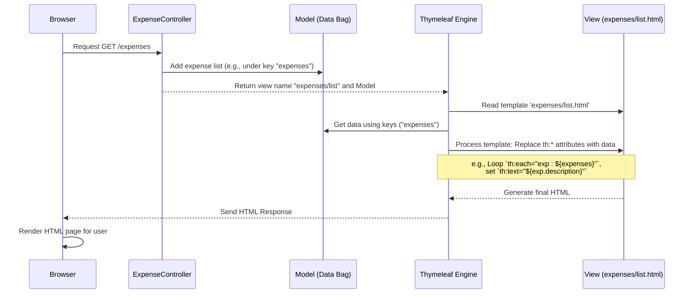

# Chapter 2: User Interface Views (Thymeleaf Templates)

In [Chapter 1: Web Request Handler (Controller)](01_web_request_handler__controller_.md), we learned how the `ExpenseController` acts like a traffic controller, handling requests from your browser. We saw that when you ask to see your expenses, the controller gathers the data and then decides *which page* to show you by returning a name like `"expenses/list"`.

But what *is* `"expenses/list"`? And how does the list of expenses actually appear on the web page you see in your browser? That's where **User Interface Views** come in!

## What's the Big Idea? The Display Screen & Forms

Think about using an ATM. You interact with it through a screen. That screen shows you your balance, lists transaction options, and provides forms (like a keypad) to enter your PIN or the amount you want to withdraw.

In our Budget Tracer web application, the **User Interface Views** are like that ATM screen. They are:

1.  **The Display:** They define *what* the user sees – the layout, the text, the buttons, the images.
2.  **The Forms:** They provide ways for the user to interact and send information back to the application, like filling out a form to add a new expense.

These views are essentially HTML files, the standard language web browsers understand for structuring content. However, just plain HTML is static – it always looks the same. How do we show *your specific* expense list, which changes every time you add something? We need a way to make the HTML dynamic.

## Meet Thymeleaf: The Template Engine

Imagine you have a fill-in-the-blanks invitation template:

"You are invited to ______'s party on ______ at ______."

This template provides the structure, but the specific details (guest name, date, location) are missing. You need something (or someone) to fill in those blanks with the correct information for each guest.

**Thymeleaf** is a "template engine" for our Java web application. It works like this:

1.  We create HTML files that act as **templates** (like the invitation).
2.  These templates contain standard HTML mixed with special **Thymeleaf attributes** (like the blanks `______`). These attributes are instructions telling Thymeleaf where to put dynamic data.
3.  The [Controller](01_web_request_handler__controller_.md) prepares the data (like the guest list and party details) and puts it in the `Model` bag.
4.  The Controller tells Spring to use a specific Thymeleaf template (e.g., `"expenses/list"`).
5.  Thymeleaf takes the template and the data from the `Model`, follows the instructions (fills in the blanks), and generates the final, complete HTML page.
6.  This final HTML is sent back to your browser to be displayed.

Thymeleaf lets us write HTML that looks almost normal, but with added superpowers to display dynamic data and interact with the backend Java code.

## Looking at a Thymeleaf Template: `expenses/list.html`

Let's peek inside the file that the `ExpenseController` uses when you visit the main `/expenses` page. This file lives at `src/main/resources/templates/expenses/list.html`. We won't look at the whole file, just some key parts.

```html
<!-- File: src/main/resources/templates/expenses/list.html (Snippet 1) -->
<!DOCTYPE html>
<!-- We need this 'xmlns:th' part to tell the browser and tools this isn't just plain HTML -->
<html xmlns:th="http://www.thymeleaf.org">
<body>

  <!-- ... other HTML ... -->

  <div class="card content-card">
    <div class="card-body">
      <div class="table-responsive">
        <table class="table">
          <thead> <!-- Table Header: Column names -->
            <tr> <th>Date</th> <th>Description</th> <!-- ... more columns --> </tr>
          </thead>
          <tbody>
            <!-- SPECIAL THYMELEAF INSTRUCTION: Loop through expenses -->
            <tr th:each="exp : ${expenses}">
              <!-- Display the formatted date of ONE expense -->
              <td> <span th:text="${#temporals.format(exp.date, 'MMM dd, yyyy')}">Jan 01, 2024</span> </td>
              <!-- Display the description of ONE expense -->
              <td> <span th:text="${exp.description}">Sample Expense</span> </td>
              <!-- ... more columns for amount, category, actions ... -->
            </tr>
            <!-- SPECIAL THYMELEAF INSTRUCTION: Show this row ONLY if the expenses list is empty -->
            <tr th:if="${#lists.isEmpty(expenses)}">
              <td colspan="5">No expenses found.</td>
            </tr>
          </tbody>
        </table>
      </div>
    </div>
  </div>

  <!-- ... other HTML ... -->

</body>
</html>
```

**Explanation:**

1.  **`xmlns:th="http://www.thymeleaf.org"`:** This line in the `<html>` tag is important. It declares the `th:` prefix, telling tools and Thymeleaf itself that attributes starting with `th:` are special instructions.
2.  **`th:each="exp : ${expenses}"`:** This is a loop!
    *   `${expenses}`: This tries to find something called "expenses" in the `Model` bag that the [Controller](01_web_request_handler__controller_.md) prepared. Remember `model.addAttribute("expenses", expenseService.getAllExpenses());`? That's where `${expenses}` comes from – it holds the list of all expense objects.
    *   `exp : ...`: For each item in the `${expenses}` list, Thymeleaf will create a copy of the `<tr>` (table row) element. Inside that copy, the current item will be available under the temporary variable name `exp`.
3.  **`th:text="${#temporals.format(exp.date, 'MMM dd, yyyy')}"`:** This displays text dynamically.
    *   `exp.date`: Accesses the `date` field of the *current* expense object (`exp`) from the loop. We'll see the structure of an expense object in [Chapter 3: Expense Data Model](03_expense_data_model.md).
    *   `#temporals.format(...)`: Thymeleaf provides helpful tools called "utility objects". `#temporals` helps work with dates and times. Here, we're formatting the date into a more readable format (like "Jan 01, 2024").
    *   The text inside the `<span>` tag (`Jan 01, 2024`) is just placeholder content. When Thymeleaf processes the template, it will *replace* this placeholder with the actual formatted date from the `exp` object.
4.  **`th:text="${exp.description}"`:** Similarly, this gets the `description` field from the current expense (`exp`) and displays it inside the `<span>`. The "Sample Expense" text is just a placeholder.
5.  **`th:if="${#lists.isEmpty(expenses)}"`:** This is a conditional instruction.
    *   `#lists.isEmpty(expenses)`: Uses another utility object, `#lists`, to check if the `${expenses}` list (from the Model) is empty.
    *   If the condition is true (the list *is* empty), Thymeleaf will include this `<tr>` element in the final HTML.
    *   If the condition is false (the list has expenses), Thymeleaf will *remove* this entire `<tr>` element. This is how we show the "No expenses found" message only when needed.

So, Thymeleaf acts like a mail merge tool for HTML. It takes the template (`list.html`), merges it with the data from the Controller's `Model` (`${expenses}`), and produces the final HTML that shows your personalized expense list.

## Handling Forms: `expenses/edit.html`

Views aren't just for displaying data; they also handle forms for user input. Let's look at a snippet from the edit expense form (`src/main/resources/templates/expenses/edit.html`). This form is used both when adding a *new* expense (with empty fields) and *editing* an existing one (with fields pre-filled).

```html
<!-- File: src/main/resources/templates/expenses/edit.html (Snippet) -->
<html xmlns:th="http://www.thymeleaf.org">
<body>
  <!-- ... card layout ... -->
  
  <!-- This form will send data back to the Controller -->
  <!-- th:action defines WHERE the data goes -->
  <!-- th:object links the form to an object from the Model -->
  <form th:action="@{/expenses/update/{id}(id=${expense.id})}" th:object="${expense}" method="post">
    
    <!-- Input field for the description -->
    <div class="mb-3">
      <label for="description" class="form-label">Description</label>
      <!-- th:field connects this input to the 'description' field of the th:object -->
      <input type="text" class="form-control" id="description" th:field="*{description}" required>
      <!-- Show error message ONLY if there's an error for the 'description' field -->
      <div class="text-danger" th:if="${#fields.hasErrors('description')}" th:errors="*{description}">Error placeholder</div>
    </div>

    <!-- Input field for the amount -->
    <div class="mb-3">
      <label for="amount" class="form-label">Amount</label>
      <!-- th:field connects this input to the 'amount' field -->
      <input type="number" class="form-control" id="amount" th:field="*{amount}" step="0.01" required>
      <div class="text-danger" th:if="${#fields.hasErrors('amount')}" th:errors="*{amount}">Error placeholder</div>
    </div>

    <!-- ... other fields for date, category, notes ... -->

    <button type="submit" class="btn btn-primary">Update Expense</button>
  </form>
  <!-- ... -->
</body>
</html>
```

**Explanation:**

1.  **`th:object="${expense}"`:** This attribute on the `<form>` tag links the entire form to an object named "expense" that the [Controller](01_web_request_handler__controller_.md) put in the `Model`. Remember, for the *add* form on the `list.html` page, the Controller added `model.addAttribute("expense", new Expense());` (an empty expense). For the *edit* form, the Controller would fetch the specific expense to be edited and put *that* into the `Model` using the same name, "expense".
2.  **`th:action="@{/expenses/update/{id}(id=${expense.id})}"`:** This sets the URL where the form data will be sent when the user clicks "Submit" (or "Update Expense").
    *   `@{...}`: This is Thymeleaf's special syntax for creating URLs. It's smart and can handle context paths correctly.
    *   `/expenses/update/{id}`: This defines the path structure. `{id}` is a placeholder.
    *   `(id=${expense.id})`: This part fills the `{id}` placeholder with the actual ID value from the `${expense}` object's `id` field. So, if you're editing expense #5, the action URL will become `/expenses/update/5`. The Controller handling the `/expenses/update/{id}` path will then know which expense to update.
3.  **`th:field="*{description}"`:** This is the magic that connects an HTML `<input>` to a specific field *within* the object defined by `th:object`.
    *   `*{description}`: The asterisk `*` refers to the object selected by the nearest `th:object` (which is `${expense}` in this case). So, `*{description}` means "the `description` field of the `${expense}` object".
    *   `th:field` does several things automatically:
        *   Sets the `name` attribute of the input (e.g., `name="description"`).
        *   Sets the `id` attribute (usually the same as the name).
        *   Sets the `value` attribute to the current value of `expense.description`. This is how the form fields get pre-filled when you edit an existing expense!
4.  **`th:if="${#fields.hasErrors('description')}"`:** This checks if there were any validation errors associated with the `description` field when the form was last submitted (we saw error handling in the Controller's `saveExpense` method in Chapter 1). If there was an error (e.g., the user left it blank), this `<div>` will be shown.
5.  **`th:errors="*{description}"`:** If there are errors for the `description` field, this attribute will display the error message(s) provided by the validation framework inside the `<div>`.

When you fill out this form and click "Update Expense", the browser sends the data (description, amount, etc.) to the URL specified in `th:action`. The Controller method listening at that URL receives the data, often automatically converting it back into an `Expense` object (as we saw with `@ModelAttribute` in Chapter 1), and then processes it (e.g., saves the changes).

## How it Works: Controller and View Interaction

Let's revisit the flow for displaying the expense list, focusing now on the View's role:



**Walkthrough:**

1.  **Browser** requests the `/expenses` page.
2.  **ExpenseController** handles the request. It gets the expense data and adds it to the **Model** bag (e.g., `model.addAttribute("expenses", ...)`)
3.  **Controller** returns the view name `"expenses/list"` to the framework.
4.  The framework gives the view name and the **Model** to the **Thymeleaf Engine**.
5.  **Thymeleaf** reads the `expenses/list.html` **View** template file.
6.  **Thymeleaf** looks at the special `th:` attributes in the template. For each one, it fetches the required data from the **Model** (e.g., it gets the list associated with the key "expenses" for `th:each`).
7.  **Thymeleaf** processes the template, replacing placeholders and executing instructions (like loops `th:each` or conditionals `th:if`), filling in the data from the Model.
8.  The **View** template, once processed by Thymeleaf, becomes a standard **HTML** page.
9.  **Thymeleaf** sends this final HTML back to the **Browser**.
10. The **Browser** displays the page, showing the user the dynamically generated list of expenses.

## Conclusion

You've now seen the **User Interface Views**, the HTML files that define what the user sees and interacts with. You learned:

*   Views are typically HTML files located in `src/main/resources/templates`.
*   They use the **Thymeleaf** template engine to become dynamic.
*   Thymeleaf uses special attributes (like `th:text`, `th:each`, `th:if`, `th:field`, `th:action`) to insert data from the Controller's `Model` and handle form processing.
*   `${...}` is used to access variables from the Model (like `${expenses}`).
*   `*{...}` is used with `th:field` to bind form inputs to object properties (like `*{description}`).
*   `@{...}` is used to create URLs (like `@{/expenses}`).
*   Views receive data from the Controller via the `Model` and generate the final HTML sent to the browser.
*   Forms in views send data back to specific Controller methods.

We've seen the Controller handling requests and the View displaying information. But what exactly *is* an "expense" in our code? What data does it hold? In the next chapter, we'll look at the blueprint for our expense data.

Next up: [Chapter 3: Expense Data Model](03_expense_data_model.md)

---

Generated by [AI Codebase Knowledge Builder](https://github.com/The-Pocket/Tutorial-Codebase-Knowledge)