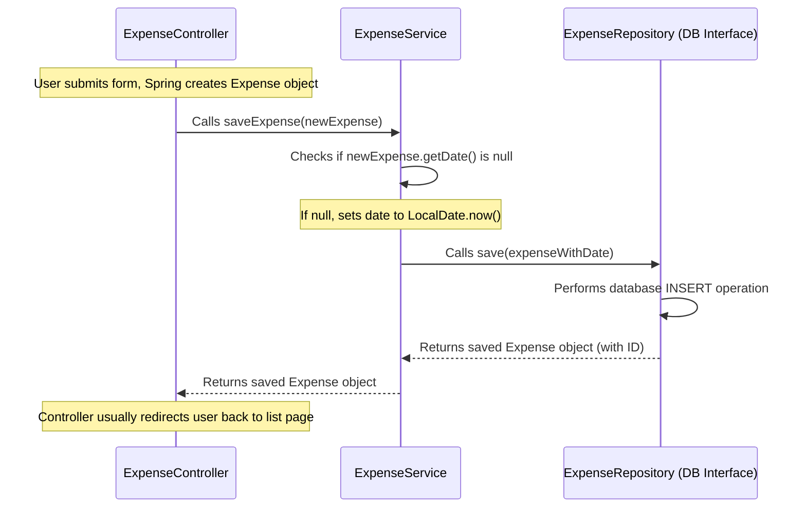

# Chapter 4: Business Logic (Service)

In [Chapter 3: Expense Data Model](03_expense_data_model.md), we created the blueprint for what an expense looks like in our application – the `Expense` class. We know *what* data we're dealing with (description, amount, date, etc.).

But who is in charge of *managing* these expenses? When the [Controller](01_web_request_handler__controller_.md) receives a request to save a new expense or show a list of existing ones, who actually performs these tasks and makes sure any rules are followed?

This is where the **Business Logic** or **Service** layer comes in.

## What's the Big Idea? The Expense Department Manager

Imagine our Budget Tracer application is like a company.
*   The [Controller](01_web_request_handler__controller_.md) is the **Receptionist**, greeting requests and directing them.
*   The [Data Persistence (Repository)](05_data_persistence__repository_.md) (which we'll see in the next chapter) is like the **Filing Clerk**, responsible for physically storing and retrieving data files (expenses) from the filing cabinet (database).
*   The [Expense Data Model](03_expense_data_model.md) is the standard **Expense Report Form** blueprint everyone uses.

But who understands the *process*? Who knows that when a new expense report comes in, the date needs to be filled in if it's missing? Who knows how to ask the Filing Clerk to find all reports from last month?

That's the **Expense Department Manager** – our **Service** layer.

The **Service** layer (`ExpenseService` in our case) acts as the crucial intermediary:

1.  **Gets Requests from the Controller:** The Controller tells the Service *what* needs to be done (e.g., "save this expense", "get all expenses").
2.  **Applies Business Rules:** The Service implements the core logic and procedures. This might involve:
    *   Checking data (beyond the basic checks in the Model).
    *   Setting default values (like setting today's date if none was provided).
    *   Calculating derived values (maybe later we add logic to calculate totals).
    *   Coordinating multiple steps if needed.
3.  **Delegates Storage Tasks:** The Service tells the [Repository](05_data_persistence__repository_.md) (the Filing Clerk) to actually save, fetch, update, or delete the data in the database.
4.  **Returns Results to the Controller:** The Service gives the results (e.g., the list of expenses, the saved expense) back to the Controller, who then prepares the response for the user.

This separation keeps our code organized: the Controller focuses on web stuff, the Repository on database stuff, and the Service on the *how-to* of managing expenses.

## Meet the `ExpenseService`

In our project, the class responsible for managing expense logic is `ExpenseService.java`.

```java
// File: src/main/java/com/expensetracker/service/ExpenseService.java

package com.expensetracker.service;

// Imports: We need the Expense blueprint and the Repository helper
import com.expensetracker.model.Expense;
import com.expensetracker.repository.ExpenseRepository;
import org.springframework.beans.factory.annotation.Autowired;
import org.springframework.stereotype.Service; // Mark this as a Service component
import java.time.LocalDate;
import java.util.List;

// @Service: Tells Spring Framework this class handles business logic
@Service
public class ExpenseService {

    // The Service needs help from the Repository to access data
    private final ExpenseRepository expenseRepository;

    // Constructor: How an ExpenseService is created
    // @Autowired tells Spring to provide the necessary ExpenseRepository
    @Autowired
    public ExpenseService(ExpenseRepository expenseRepository) {
        this.expenseRepository = expenseRepository;
    }

    // ... methods for managing expenses go here ...
}
```

**Explanation:**

1.  **`package com.expensetracker.service;`**: This class lives in the `service` package, grouping our business logic components.
2.  **`import ...;`**: We import the `Expense` model (the blueprint) and the `ExpenseRepository` (the interface for the Filing Clerk, which we'll see in [Chapter 5](05_data_persistence__repository_.md)).
3.  **`@Service`**: This annotation is like a label telling the Spring framework, "This class is a Service component, responsible for business logic." Spring uses this to manage the creation and wiring of objects.
4.  **`private final ExpenseRepository expenseRepository;`**: This declares that our `ExpenseService` needs a helper object that knows how to talk to the database – the `ExpenseRepository`. It's `final` because once the Service is created, its Repository helper won't change.
5.  **`public ExpenseService(ExpenseRepository expenseRepository)`**: This is the constructor. The `@Autowired` annotation tells Spring: "When you create an `ExpenseService`, please automatically find and provide the required `ExpenseRepository` instance." This is called *dependency injection* – the Service doesn't create its own Repository; it receives it from the framework.

## Core Tasks of the `ExpenseService`

Let's look at some key methods inside `ExpenseService` and see what they do.

### Getting All Expenses

The Controller needs to show a list of all expenses. It asks the `ExpenseService`.

```java
// Inside ExpenseService.java

public List<Expense> getAllExpenses() {
    // Ask the repository (Filing Clerk) for all expense records
    return expenseRepository.findAll();
}
```

*   **Input:** None.
*   **Action:** The Service simply delegates the request directly to the `expenseRepository`. It calls the `findAll()` method provided by the repository.
*   **Output:** It returns whatever the repository gives back – a `List` containing all the `Expense` objects found in the database.

### Saving an Expense (with Logic!)

When the Controller gets a new expense from a form, it asks the Service to save it.

```java
// Inside ExpenseService.java

public Expense saveExpense(Expense expense) {
    // Business Rule: If the user didn't specify a date, use today's date.
    if (expense.getDate() == null) {
        expense.setDate(LocalDate.now()); // Set date to the current date
    }
    // Ask the repository (Filing Clerk) to save this expense record
    return expenseRepository.save(expense);
}
```

*   **Input:** An `Expense` object containing the data submitted by the user (e.g., description, amount, maybe a date).
*   **Action:**
    1.  **Business Logic:** It first checks if the `date` field in the received `Expense` object is missing (`null`).
    2.  If the date is missing, it applies a business rule: set the date to the current system date (`LocalDate.now()`).
    3.  **Delegation:** It then passes the (potentially modified) `Expense` object to the `expenseRepository`'s `save()` method to store it in the database.
*   **Output:** It returns the `Expense` object that was saved (which might now include a database-generated ID and the default date if it was applied).

This shows the Service acting as more than just a pass-through. It enforces a simple business rule before delegating the storage task.

### Finding Specific Expenses

Often, we need to find expenses based on criteria, like an ID, a date range, or a category.

```java
// Inside ExpenseService.java

// Find one expense by its unique ID
public Expense getExpenseById(Long id) {
    return expenseRepository.findById(id)
        // Handle case where no expense with that ID is found
        .orElseThrow(() -> new RuntimeException("Expense not found with id: " + id));
}

// Find expenses within a specific date range
public List<Expense> getExpensesByDateRange(LocalDate startDate, LocalDate endDate) {
    return expenseRepository.findByDateBetween(startDate, endDate);
}

// Find expenses belonging to a specific category
public List<Expense> getExpensesByCategory(String category) {
    return expenseRepository.findByCategory(category);
}
```

*   **Action:** In these cases, the Service primarily acts as a translator. It receives the request (e.g., "get expense with ID 5") and calls the corresponding method on the `expenseRepository` (e.g., `findById(5)`). The repository handles the actual database query construction.
*   **Error Handling:** Notice in `getExpenseById`, the service also adds logic (`.orElseThrow(...)`) to handle the situation where the repository doesn't find an expense with the given ID, preventing errors further down the line.

### Deleting an Expense

```java
// Inside ExpenseService.java

public void deleteExpense(Long id) {
    // Ask the repository (Filing Clerk) to delete the record with this ID
    expenseRepository.deleteById(id);
}
```

*   **Input:** The unique `id` of the expense to delete.
*   **Action:** The Service directly tells the `expenseRepository` to delete the expense identified by the given `id`.
*   **Output:** None (`void`).

## How it Works: Service in Action (Saving an Expense)

Let's trace the flow when a user submits the "Add Expense" form:



**Walkthrough:**

1.  The [Controller](01_web_request_handler__controller_.md) receives the submitted form data, which the framework turns into an `Expense` object (`newExpense`).
2.  The Controller calls the `saveExpense` method on the `ExpenseService`, passing the `newExpense` object.
3.  The `ExpenseService` executes its logic: it checks if the date is missing and sets it to today's date if necessary.
4.  The `ExpenseService` calls the `save` method on the `ExpenseRepository`, passing the potentially updated `Expense` object.
5.  The `ExpenseRepository` (magic we'll see in Chapter 5) translates this into a database command (like SQL `INSERT`) and executes it.
6.  The database saves the record and potentially assigns a unique ID.
7.  The `ExpenseRepository` returns the final saved `Expense` object (now including the ID) back to the `ExpenseService`.
8.  The `ExpenseService` returns the saved `Expense` object back to the `ExpenseController`.
9.  The `ExpenseController` typically then redirects the user's browser to the main expense list page to see the newly added item.

## Conclusion

You've now met the **Service layer**, embodied by our `ExpenseService`. It's the crucial middle layer that acts as the **manager** for our expense data.

*   It sits between the [Controller](01_web_request_handler__controller_.md) (web request handler) and the [Repository](05_data_persistence__repository_.md) (data storage handler).
*   It's marked with the `@Service` annotation.
*   It contains the core **business logic** – the rules and procedures for managing expenses (e.g., setting default dates).
*   It **orchestrates** actions by calling methods on the Repository to perform the actual data fetching, saving, or deleting.
*   It helps keep our application organized by separating concerns.

We've seen the Service tell the Repository what to do (`findAll()`, `save()`, `findById()`, `deleteById()`). But how does the Repository actually interact with the database? How does it know *how* to find or save expenses? That's the subject of our next chapter!

Next up: [Chapter 5: Data Persistence (Repository)](05_data_persistence__repository_.md)

---

Generated by [AI Codebase Knowledge Builder](https://github.com/The-Pocket/Tutorial-Codebase-Knowledge)