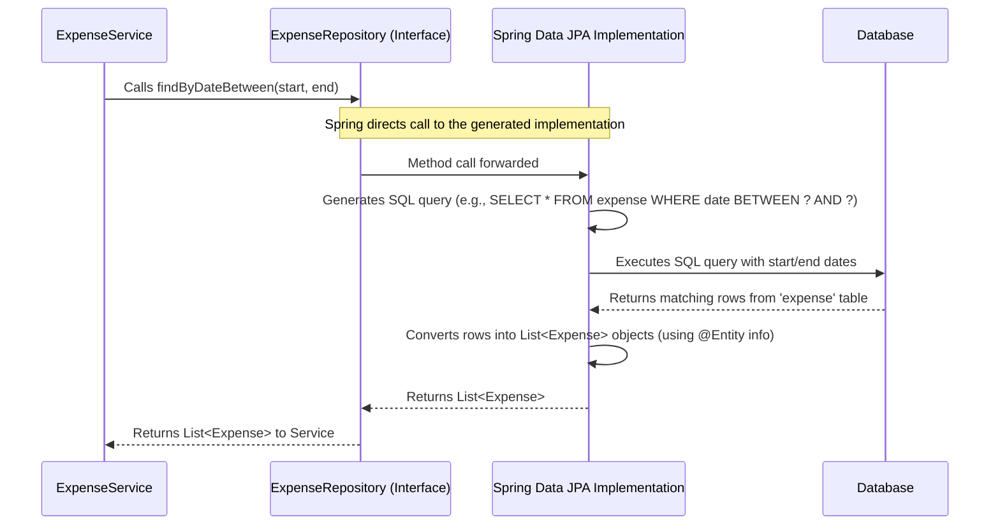

# Chapter 5: Data Persistence (Repository)

In [Chapter 4: Business Logic (Service)](04_business_logic__service_.md), we met the `ExpenseService`, our application's "Expense Department Manager." We saw how the Service handles the logic and rules for managing expenses. But when the Service needs to actually *save* a new expense or *find* existing ones, who does it talk to? It talks to the **Data Persistence** layer, often called the **Repository**.

## What's the Big Idea? The Specialized Librarian

Imagine our expense data lives in a huge, complex library (the database). We need a way to interact with this library – to store new expense records (books), find specific ones, update them, or remove them.

Doing this directly could be complicated. We'd need to know the exact location of everything, how the library's filing system works (like writing complex SQL database queries), and handle all the low-level details. That sounds tedious and error-prone!

Instead, we hire a **Specialized Librarian** for expense records. This is our **Repository** (`ExpenseRepository`).

*   **You tell the Librarian what you need:** "Find all expenses from last week," "Save this new expense record," "Get me the expense with ID number 123."
*   **The Librarian handles the details:** They know exactly how to interact with the library's storage system (the database), find the right shelves (tables), use the index (queries), and retrieve or store the information correctly.
*   **You get simple results:** The Librarian brings you the specific records you asked for, or confirms that your new record has been stored.

The **Repository** layer in our application acts exactly like this librarian. It provides a simple, clear way for our [Service](04_business_logic__service_.md) layer to interact with the database for `Expense` data, hiding the complexities of database queries.

## Meet the `ExpenseRepository` Interface

In Java, this "librarian" is often defined using an `interface`. An interface is like a contract – it defines *what* tasks the librarian *can* do, but not necessarily *how* they do them (we'll see who handles the "how" soon!).

Let's look at our `ExpenseRepository` interface:

```java
// File: src/main/java/com/expensetracker/repository/ExpenseRepository.java

package com.expensetracker.repository; // Lives in the 'repository' package

// Imports needed tools
import java.time.LocalDate;
import java.util.List;
import org.springframework.data.jpa.repository.JpaRepository; // The magic ingredient!
import com.expensetracker.model.Expense; // Our Expense blueprint

/**
 * Repository interface for Expense data.
 * Uses Spring Data JPA to automatically handle database operations.
 */
public interface ExpenseRepository extends JpaRepository<Expense, Long> {

    // Custom query method: Spring Data JPA will automatically create
    // the query based on the method name! Finds expenses where the
    // 'date' field is between the given startDate and endDate.
    List<Expense> findByDateBetween(LocalDate startDate, LocalDate endDate);

    // Another custom query method: Finds expenses by their category.
    List<Expense> findByCategory(String category);

    // We also get methods like findAll(), findById(), save(), deleteById()
    // FOR FREE from JpaRepository! No need to declare them here.
}
```

**Breaking it Down:**

1.  **`public interface ExpenseRepository ...`**: This declares we're defining a contract (an interface) named `ExpenseRepository`. It specifies the *methods* our expense librarian must offer.
2.  **`extends JpaRepository<Expense, Long>`**: This is the most important part!
    *   `JpaRepository`: This is a powerful interface provided by a framework called **Spring Data JPA**. Think of it as a super-librarian template.
    *   `<Expense, Long>`: We tell `JpaRepository` two things:
        *   `Expense`: The type of data this repository manages (our `Expense` objects from [Chapter 3: Expense Data Model](03_expense_data_model.md)).
        *   `Long`: The data type of the unique ID field (`id`) within our `Expense` object.
    *   **The Magic:** Just by *extending* `JpaRepository`, our `ExpenseRepository` automatically inherits a whole set of standard librarian methods **without us writing any code for them!** These include:
        *   `save(Expense expense)`: Saves a new expense or updates an existing one.
        *   `findById(Long id)`: Finds an expense by its unique ID.
        *   `findAll()`: Finds all expenses.
        *   `deleteById(Long id)`: Deletes an expense by its ID.
        *   And several others!
3.  **`List<Expense> findByDateBetween(LocalDate startDate, LocalDate endDate);`**: This is a *custom* method we've added to the contract.
    *   **More Magic:** We only need to declare the method signature here. Spring Data JPA is smart enough to look at the method name (`findByDateBetween`), see that our `Expense` object has a `date` field, and automatically generate the necessary database query (like `SELECT * FROM expense WHERE date >= startDate AND date <= endDate`) behind the scenes!
4.  **`List<Expense> findByCategory(String category);`**: Another custom finder method. Spring Data JPA will generate a query to find expenses matching the provided `category` string.

So, our `ExpenseRepository` interface is incredibly concise. We define the contract, leverage `JpaRepository` for standard operations, and simply declare the names of custom queries we need. Spring Data JPA does the heavy lifting of implementing these methods.

## How the Service Uses the Repository

Remember our `ExpenseService` from [Chapter 4](04_business_logic__service_.md)? It needed a way to interact with data. It uses the `ExpenseRepository` like this:

```java
// Inside ExpenseService.java (Snippet from Chapter 4)

@Service
public class ExpenseService {

    private final ExpenseRepository expenseRepository; // The librarian helper

    @Autowired
    public ExpenseService(ExpenseRepository expenseRepository) {
        this.expenseRepository = expenseRepository;
    }

    // Example 1: Getting all expenses
    public List<Expense> getAllExpenses() {
        // Just ask the librarian!
        return expenseRepository.findAll();
    }

    // Example 2: Saving an expense
    public Expense saveExpense(Expense expense) {
        // ... (maybe some business logic like setting the date) ...
        // Ask the librarian to save it!
        return expenseRepository.save(expense);
    }

    // Example 3: Using a custom finder
    public List<Expense> getExpensesByDateRange(LocalDate startDate, LocalDate endDate) {
        // Ask the librarian using our custom request!
        return expenseRepository.findByDateBetween(startDate, endDate);
    }
}
```

The `ExpenseService` simply calls the methods defined in the `ExpenseRepository` interface. It doesn't need to know *how* the repository talks to the database; it just trusts the "librarian" to do its job correctly.

## Under the Hood: Spring Data JPA's Magic Show

We defined an `interface` (`ExpenseRepository`), which is just a contract. But interfaces don't have actual code bodies. So, when the `ExpenseService` calls `expenseRepository.findAll()`, whose code is actually running?

This is where **Spring Data JPA** performs its magic:

1.  **Scanning:** When your application starts, Spring Boot (which uses Spring Data JPA) scans your code and finds interfaces that extend `JpaRepository` (like our `ExpenseRepository`).
2.  **Implementation Generation:** For each such interface, Spring Data JPA *automatically generates a proxy class* that *implements* the interface behind the scenes. Think of it as Spring hiring an actual librarian (creating a real object) based on the job description (our interface).
3.  **Method Implementation:**
    *   For standard methods inherited from `JpaRepository` (like `findAll`, `save`, `findById`), the generated class contains the actual code to perform these common database operations (using JPA standards and often generating SQL).
    *   For custom finder methods (like `findByDateBetween`), Spring Data JPA parses the method name, figures out the intended database query based on your `Expense` model's fields, and writes the code to execute that specific query.
4.  **Injection:** When our `ExpenseService` asks for an `ExpenseRepository` (using `@Autowired`), Spring provides an instance of this automatically generated implementation class.

So, we write the interface (the contract), and Spring Data JPA writes the actual database interaction code for us!

Let's visualize the flow when the Service asks for expenses between two dates:



**Walkthrough:**

1.  The **ExpenseService** calls the `findByDateBetween` method on the `ExpenseRepository` interface.
2.  Spring automatically directs this call to the **Spring Data JPA Implementation** object that it created for our interface.
3.  The implementation object analyzes the method name (`findByDateBetween`) and generates the appropriate **SQL query** for the underlying database.
4.  It sends this **SQL query** to the **Database** along with the `startDate` and `endDate` parameters.
5.  The **Database** executes the query and sends back the matching rows.
6.  The implementation object takes these rows and uses the mapping information from our `@Entity` [Expense Model](03_expense_data_model.md) to convert them into a `List` of `Expense` objects.
7.  This `List<Expense>` is returned back through the interface to the **ExpenseService**.

All that database complexity is handled automatically, just by defining the interface correctly!

## Conclusion

You've now explored the **Data Persistence** layer and its key component, the **Repository** (`ExpenseRepository`). You learned:

*   The Repository acts like a **specialized librarian**, simplifying database interactions for the [Service](04_business_logic__service_.md) layer.
*   It's defined as a Java `interface` that specifies *what* data operations can be performed.
*   By extending `JpaRepository<Expense, Long>`, we get many standard database methods (like `save`, `findAll`, `findById`, `deleteById`) **for free**.
*   **Spring Data JPA** magically generates the actual implementation code for our repository interface at runtime.
*   We can define **custom queries** simply by declaring methods with specific names (like `findByDateBetween`, `findByCategory`), and Spring Data JPA will implement them automatically.
*   This drastically reduces the amount of "boilerplate" database code we need to write.

We've now covered the main backend components: the [Controller](01_web_request_handler__controller_.md) handling web requests, the [View](02_user_interface_views__thymeleaf_templates_.md) displaying the UI, the [Model](03_expense_data_model.md) defining our data structure, the [Service](04_business_logic__service_.md) managing business logic, and the [Repository](05_data_persistence__repository_.md) handling data storage.

How do we ensure a consistent look and feel across different pages (Views) in our application? That's where layout templates come in.

Next up: [Chapter 6: Master Layout Template](06_master_layout_template.md)

---

Generated by [AI Codebase Knowledge Builder](https://github.com/The-Pocket/Tutorial-Codebase-Knowledge)