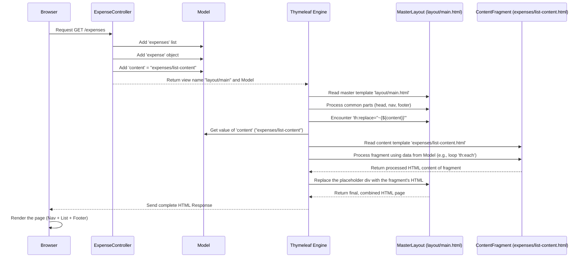

# Chapter 6: Master Layout Template

Welcome back! In [Chapter 5: Data Persistence (Repository)](05_data_persistence__repository_.md), we saw how the `ExpenseRepository` acts like a helpful librarian, managing the storage and retrieval of our expense data from the database without us needing to know the low-level details.

Now, let's shift our focus back to what the user sees – the User Interface ([Chapter 2](02_user_interface_views__thymeleaf_templates_.md)). Have you noticed how many websites have the same navigation bar at the top and the same footer information at the bottom on *every single page*? Imagine having to copy and paste that same navigation bar HTML code into every single `.html` file in our project (`list.html`, `edit.html`, `stats.html`, etc.). If we needed to add a new link to the navigation, we'd have to change it in *all* those files! That sounds like a recipe for mistakes and extra work.

There must be a better way! This is where the **Master Layout Template** comes in.

## What's the Big Idea? The Picture Frame

Think about a picture frame. The frame itself stays the same – it provides the border, the structure, and maybe the glass. But the picture *inside* the frame can change. You can swap out a photo of a cat for a photo of a landscape, but the frame remains.

Or think about a presentation using software like PowerPoint or Google Slides. You can create a "master slide" that defines the background, the company logo in the corner, and the standard font style. Then, each individual slide you create automatically gets that standard look, and you only need to add the specific content (text, charts, images) for that particular slide.

A **Master Layout Template** in our web application works exactly like that picture frame or master slide. It defines:

1.  **The Common Structure:** The HTML, `<head>` section (with common CSS and JavaScript links), the navigation bar, the footer, etc., that should appear on *most* pages.
2.  **A Placeholder:** An empty spot within that structure where the unique content for each specific page will be inserted.

This way, we define the common elements *once* in the master template. Then, our individual page templates (like the expense list or the edit form) only need to define their *specific* content. The system then automatically combines the master layout and the specific content to create the final page shown to the user. This follows the **DRY** principle: **D**on't **R**epeat **Y**ourself.

## Meet `layout/main.html`: Our Master Frame

In our project, the master layout template is the file `src/main/resources/templates/layout/main.html`. Let's look at its key parts.

```html
<!-- File: src/main/resources/templates/layout/main.html (Simplified) -->
<!DOCTYPE html>
<html xmlns:th="http://www.thymeleaf.org">

<head>
  <meta charset="UTF-8">
  <title>Expense Tracker</title>
  <!-- Common Stylesheets (Bootstrap, Font Awesome, Custom) -->
  <link href="https://cdn.jsdelivr.net/npm/bootstrap@5.3.0/dist/css/bootstrap.min.css" ...>
  <link href="https://cdnjs.cloudflare.com/ajax/libs/font-awesome/6.0.0/css/all.min.css" ...>
  <link rel="stylesheet" th:href="@{/css/main.css}" /> <!-- Our custom styles -->
</head>

<body>
  <!-- === COMMON NAVIGATION BAR === -->
  <nav class="navbar navbar-expand-lg">
    <div class="container">
      <a class="navbar-brand" href="/expenses">Expense Tracker</a>
      <!-- Navigation Links -->
      <ul class="navbar-nav ms-auto">
        <li class="nav-item"><a class="nav-link" href="/expenses">Expenses</a></li>
        <li class="nav-item"><a class="nav-link" href="/expenses?view=calendar">Calendar</a></li>
        <!-- ... other common links ... -->
      </ul>
    </div>
  </nav>

  <!-- === PLACEHOLDER FOR PAGE-SPECIFIC CONTENT === -->
  <div class="container mt-4">
    <!-- This div will be REPLACED by the content of the template
         specified by the 'content' variable from the Model -->
    <div th:replace="~{${content}}">
      <!-- Fallback text: You won't see this if 'content' is set correctly -->
      Page content goes here...
    </div>
  </div>

  <!-- === COMMON FOOTER === -->
  <footer class="footer mt-5 py-3">
    <div class="container text-center">
      <span class="text-white">© 2024 Expense Tracker.</span>
    </div>
  </footer>

  <!-- Common JavaScript -->
  <script src="https://cdn.jsdelivr.net/npm/bootstrap@5.3.0/dist/js/bootstrap.bundle.min.js"></script>
  <!-- Maybe some custom JS -->
</body>
</html>
```

**Explanation:**

1.  **`<head>` Section:** This contains things common to all pages: the character set, the title, and links to CSS stylesheets (like Bootstrap for styling and our own `main.css`). Using `th:href="@{/css/main.css}"` ensures the link works correctly regardless of the specific page URL.
2.  **`<nav>` Section:** This defines the navigation bar that will appear at the top of every page using this layout. We only need to define it once here!
3.  **`<footer>` Section:** Similarly, this defines the footer content that appears at the bottom of every page.
4.  **Common JavaScript:** Links to common JavaScript files (like Bootstrap's JS) are included near the end of the `<body>`.
5.  **`th:replace="~{${content}}"`:** This is the crucial part – the **placeholder**.
    *   `th:replace`: This is a Thymeleaf attribute that tells the engine: "Find the template fragment specified by the expression inside the `~{...}` and completely replace this `<div>` tag with the content of that fragment."
    *   `~{${content}}`: This expression does two things:
        *   `${content}`: It looks for a variable named `content` in the `Model` object that the [Controller](01_web_request_handler__controller_.md) prepared.
        *   The value of this `content` variable is expected to be the *path* to another Thymeleaf template file (or a fragment within a file). For example, it might be `"expenses/list-content"`.
        *   `~{...}`: This syntax tells Thymeleaf to treat the result as a fragment or template path to be processed.

So, `layout/main.html` provides the frame (header, nav, footer, CSS, JS), and the `th:replace` directive defines *where* the specific picture (the page content) will be inserted.

## Providing the Content: The Specific Pages

Now, where does the value for `${content}` come from, and what do these content templates look like?

1.  **The Controller's Job:** When handling a request, the [Controller](01_web_request_handler__controller_.md) needs to do *two* things related to the view:
    *   Prepare the data needed specifically for that page (like the list of expenses).
    *   Tell Thymeleaf *which content fragment* to load into the master layout's placeholder by adding its path to the `Model`.
    *   Return the name of the **master layout template** (`layout/main`) itself.

Let's see how the `ExpenseController` might do this for the expense list page:

```java
// Inside ExpenseController.java

@GetMapping
public String listExpenses(Model model) {
    // 1. Add data needed for the content page
    model.addAttribute("expenses", expenseService.getAllExpenses());
    model.addAttribute("expense", new Expense()); // For the 'add' form

    // 2. Specify the PATH to the content fragment template
    //    This file contains *only* the list/form part of the page
    model.addAttribute("content", "expenses/list-content");

    // 3. Return the name of the MASTER layout template
    return "layout/main";
}
```

Notice the change: instead of returning `"expenses/list"` like we might have thought before, the controller now explicitly sets the `content` variable in the model and returns `"layout/main"`.

2.  **The Content Fragment Template:** We need a new template file that contains *only* the specific content for the expense list page. Let's call it `src/main/resources/templates/expenses/list-content.html`.

```html
<!-- File: src/main/resources/templates/expenses/list-content.html -->
<!-- This file ONLY contains the unique content for the expense list page -->
<div xmlns:th="http://www.thymeleaf.org"> <!-- Root element needed -->

  <h2>My Expenses</h2>

  <!-- Add Expense Form (Example) -->
  <div class="card mb-4">
    <div class="card-body">
      <h5 class="card-title">Add New Expense</h5>
      <form th:action="@{/expenses}" th:object="${expense}" method="post" class="row g-3">
         <!-- Form fields like description, amount etc. go here -->
         <div class="col-12">
             <button type="submit" class="btn btn-primary">Add Expense</button>
         </div>
      </form>
    </div>
  </div>

  <!-- Expense Table (Example) -->
  <div class="card">
    <div class="card-body">
       <h5 class="card-title">Existing Expenses</h5>
       <table class="table">
          <thead><tr><th>Desc</th><th>Amount</th></tr></thead>
          <tbody>
            <tr th:each="exp : ${expenses}">
              <td th:text="${exp.description}">Rent</td>
              <td th:text="${#numbers.formatCurrency(exp.amount)}">$100.00</td>
              <!-- Other columns -->
            </tr>
            <tr th:if="${#lists.isEmpty(expenses)}"><td colspan="2">None yet!</td></tr>
          </tbody>
       </table>
    </div>
  </div>

</div> <!-- End of root element -->
```

This `list-content.html` file **does not** have `<html>`, `<head>`, `<body>`, `<nav>`, or `<footer>` tags. It *only* contains the HTML specific to displaying the "Add Expense" form and the table of existing expenses. Thymeleaf will take this content and insert it where the `th:replace="~{${content}}"` placeholder was in `layout/main.html`.

## How It Works: Putting Frame and Picture Together

Let's trace the process when you request the `/expenses` page:



**Walkthrough:**

1.  **Browser** requests `/expenses`.
2.  **ExpenseController** handles the request.
3.  Controller adds the list of expenses (`expenses`), an empty expense object (`expense`), and the path to the content fragment (`content = "expenses/list-content"`) to the **Model**.
4.  Controller returns the master layout name (`"layout/main"`) to the **Thymeleaf Engine**.
5.  Thymeleaf reads the **Master Layout** (`layout/main.html`).
6.  It starts processing the common parts (like the `<head>` and `<nav>`).
7.  It reaches the `<div th:replace="~{${content}}">`.
8.  It looks up the value of `content` in the **Model**, finding `"expenses/list-content"`.
9.  Thymeleaf reads the specified **Content Fragment** template (`expenses/list-content.html`).
10. It processes this fragment, using data from the **Model** (like `${expenses}` for the `th:each` loop).
11. The processed HTML *from the fragment* is generated.
12. Thymeleaf takes this generated fragment HTML and uses it to *replace* the placeholder `<div>` inside the **Master Layout**.
13. The final, combined HTML (master layout structure + specific page content) is assembled.
14. **Thymeleaf** sends this complete HTML page back to the **Browser**.
15. The Browser displays the page, showing the consistent navigation and footer framing the specific expense list content.

## Conclusion

You've now learned about the **Master Layout Template** pattern, a powerful way to keep your application's look and feel consistent without repeating code.

*   It solves the problem of having common UI elements (like navigation, footers, CSS links) on multiple pages.
*   We use a central **master template** (`layout/main.html`) that defines the shared structure and includes common resources.
*   The master template uses a **placeholder** (like `th:replace="~{${content}}"`) to mark where page-specific content should go.
*   Individual pages are broken down into **content fragments** (like `expenses/list-content.html`) containing only their unique HTML.
*   The [Controller](01_web_request_handler__controller_.md) prepares data, sets the path to the correct content fragment in the `Model`, and returns the name of the master layout template.
*   Thymeleaf combines the master layout and the processed content fragment to generate the final HTML page.
*   This promotes the **DRY** principle and makes maintaining the UI much easier.

We've now seen all the major pieces of the web application interact: Controller, View, Model, Service, Repository, and now the Layout Template. But how does the whole application actually start running? What kicks everything off?

Next up: [Chapter 7: Application Entry Point](07_application_entry_point.md)

---

Generated by [AI Codebase Knowledge Builder](https://github.com/The-Pocket/Tutorial-Codebase-Knowledge)