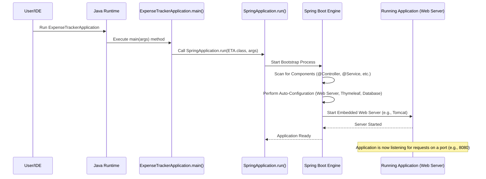

# Chapter 7: Application Entry Point

Welcome back! In [Chapter 6: Master Layout Template](06_master_layout_template.md), we learned how to create a consistent look and feel for our application using a master template, keeping our code DRY (Don't Repeat Yourself). We've now seen all the major building blocks of our `Budget_Tracer_Web_Java` application: the [Controller](01_web_request_handler__controller_.md), the [View](02_user_interface_views__thymeleaf_templates_.md), the [Model](03_expense_data_model.md), the [Service](04_business_logic__service_.md), the [Repository](05_data_persistence__repository_.md), and the [Layout](06_master_layout_template.md).

But how does everything actually start? When you click "Run" in your development environment or deploy the application to a server, what's the very first piece of code that executes and brings all these other components to life?

That's the role of the **Application Entry Point**.

## What's the Big Idea? The Ignition Key

Think about a car. It has an engine, wheels, seats, a steering wheel – all the necessary parts. But none of them do anything until you insert the key and turn the ignition. Turning the key starts the engine, powers up the electronics, and makes the whole car ready to operate.

In our web application, the **Application Entry Point** is like that ignition key. It's a specific Java class with a special method that acts as the starting signal. When the application is launched, this class is executed first. Its main job is to kickstart the **Spring Boot framework**, which is the powerful engine managing all the other components we've learned about (Controllers, Services, Repositories, etc.).

Without this entry point, the application simply wouldn't start, just like a car won't start without turning the key.

## Meet `ExpenseTrackerApplication.java`

In most Spring Boot projects, including ours, the entry point is a class usually named after the application itself, often ending with `Application`. Let's look at ours:

```java
// File: src/main/java/com/expensetracker/ExpenseTrackerApplication.java

package com.expensetracker; // Root package of our application

// Import necessary Spring Boot classes
import org.springframework.boot.SpringApplication;
import org.springframework.boot.autoconfigure.SpringBootApplication;

// THE KEY ANNOTATION! Tells Spring Boot this is the main configuration class
@SpringBootApplication
public class ExpenseTrackerApplication { // Our main class definition

    // THE STARTING METHOD! This is where Java execution begins
    public static void main(String[] args) {
        // Tell Spring Boot to start running our application
        SpringApplication.run(ExpenseTrackerApplication.class, args);
    }
}
```

**Explanation:**

1.  **`package com.expensetracker;`**: This indicates the class is in the base package of our project.
2.  **`@SpringBootApplication`**: This is a very important annotation! It's a convenience annotation provided by Spring Boot that bundles three other annotations commonly used together:
    *   `@Configuration`: Tags the class as a source of bean definitions (application components).
    *   `@EnableAutoConfiguration`: Tells Spring Boot to start adding beans based on classpath settings, other beans, and various property settings. It tries to "guess" intelligently how you want to configure things (like setting up the embedded web server).
    *   `@ComponentScan`: Tells Spring to look for other components (like our `@Controller`, `@Service`, `@Repository` annotated classes) in the current package (`com.expensetracker`) and its sub-packages, so it can manage them.
    Basically, `@SpringBootApplication` tells Spring Boot: "This is the main starting point, please scan for components and automatically configure the application based on the libraries we are using."
3.  **`public class ExpenseTrackerApplication { ... }`**: This defines the class itself.
4.  **`public static void main(String[] args)`**: This is the standard **entry point method** for any Java application. When you run the compiled Java code, the Java Virtual Machine (JVM) looks for this specific method signature (`public static void main`) and starts executing code from here.
5.  **`SpringApplication.run(ExpenseTrackerApplication.class, args);`**: This single line is where the magic happens!
    *   `SpringApplication.run(...)`: This static method is the core of Spring Boot's startup process.
    *   `ExpenseTrackerApplication.class`: We pass our main application class itself as an argument. Spring Boot uses the annotations on this class (especially `@SpringBootApplication`) to guide its setup.
    *   `args`: These are any command-line arguments passed when running the application (we usually don't use them directly in simple web apps, but they need to be passed along).

So, when you run the project:
*   The JVM finds and executes the `main` method in `ExpenseTrackerApplication`.
*   The `main` method immediately calls `SpringApplication.run()`.
*   `SpringApplication.run()` takes over and bootstraps the entire Spring Boot application context, bringing all our components together.

## How It Works: The Startup Sequence

What actually happens inside `SpringApplication.run()`? It performs several crucial tasks to get our application ready:

1.  **Creates Application Context:** It sets up the central registry (the "Application Context") where Spring will manage all the application components (beans).
2.  **Component Scanning:** Triggered by `@ComponentScan` (inside `@SpringBootApplication`), it searches through your project's packages (starting from `com.expensetracker`) for classes marked with annotations like `@Component`, `@Controller`, `@Service`, `@Repository`, etc. It creates instances (objects) of these classes and registers them in the application context. This is how Spring knows about our `ExpenseController`, `ExpenseService`, and `ExpenseRepository`.
3.  **Auto-Configuration:** Triggered by `@EnableAutoConfiguration`, Spring Boot looks at the libraries you've included (we'll see these in [Chapter 8: Dependency Management (Maven POM)](08_dependency_management__maven_pom_.md)). If it sees you have web libraries (like Spring Web MVC and Thymeleaf), it automatically configures things needed for a web application, such as:
    *   Setting up the Thymeleaf template engine to work with our [Views](02_user_interface_views__thymeleaf_templates_.md).
    *   Configuring dispatcher servlets to handle incoming web requests and route them to the correct [Controller](01_web_request_handler__controller_.md).
    *   Starting an **embedded web server** (usually Tomcat by default) so your application can listen for and respond to browser requests. You don't need to install a separate web server!
4.  **Database Connection (if applicable):** If it detects database libraries and configuration (like Spring Data JPA and our `application.properties` file with database details), it sets up the connection pool and makes the [Repository](05_data_persistence__repository_.md) layer work.
5.  **Application Ready:** Once all this setup is complete, the embedded web server starts listening for requests, and your application is up and running! You'll typically see log messages in your console indicating the application has started, often mentioning the port number (e.g., 8080).

Let's visualize this simplified startup flow:



## Conclusion

You've now learned about the **Application Entry Point** – the ignition switch for our `Budget_Tracer_Web_Java` application.

*   It's typically a class named `YourApplicationNameApplication` located in the root package.
*   It contains the standard Java `public static void main(String[] args)` method.
*   It's marked with the crucial `@SpringBootApplication` annotation.
*   The `main` method calls `SpringApplication.run()` to kickstart the Spring Boot framework.
*   Spring Boot then automatically:
    *   Scans for components ([Controllers](01_web_request_handler__controller_.md), [Services](04_business_logic__service_.md), [Repositories](05_data_persistence__repository_.md)).
    *   Configures the application based on included libraries (auto-configuration).
    *   Starts the embedded web server.
    *   Gets everything ready to handle user requests.

This entry point acts as the conductor, initiating the process that brings all the individual pieces of our application together into a working whole.

But how does Spring Boot know *which* libraries (like Spring Web, Thymeleaf, Spring Data JPA) to use for its auto-configuration magic? How are these external pieces of code included in our project? That's managed by our project's build tool and its configuration file.

Next up: [Chapter 8: Dependency Management (Maven POM)](08_dependency_management__maven_pom_.md)

---

Generated by [AI Codebase Knowledge Builder](https://github.com/The-Pocket/Tutorial-Codebase-Knowledge)