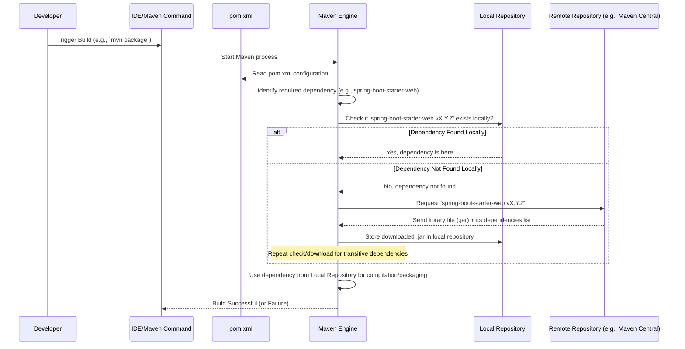

# Chapter 8: Dependency Management (Maven POM)

Welcome to the final chapter! In [Chapter 7: Application Entry Point](07_application_entry_point.md), we saw how our application starts with the `ExpenseTrackerApplication` class and the magical `@SpringBootApplication` annotation. We learned that Spring Boot automatically configures many things for us based on the libraries it finds in our project. But how does our project get those libraries, like Spring Web for our [Controller](01_web_request_handler__controller_.md), Thymeleaf for our [Views](02_user_interface_views__thymeleaf_templates_.md), or Spring Data JPA for our [Repository](05_data_persistence__repository_.md)?

## What's the Big Idea? The Project's Recipe Book

Imagine you're trying to bake a fancy cake. You wouldn't try to make *everything* from scratch, right? You wouldn't grow your own wheat for flour or raise your own chickens for eggs. You use ingredients you get from the store.

Modern software development is very similar. We build applications like our Budget Tracer by assembling pieces: our own custom code (like `ExpenseController` or `ExpenseService`) and pre-built code written by others, called **libraries** or **dependencies**. These libraries handle common tasks like running a web server, talking to a database, or generating HTML.

But how do we keep track of all the external ingredients (libraries) our project needs? And how do we make sure we get the right versions? If our project needs "Spring Web version 3.2.3" and "Thymeleaf version 3.1.2", how do we manage that?

This is where **Dependency Management** comes in, and for many Java projects, the tool for the job is **Maven**, and its configuration file is called the **POM (`pom.xml`)**.

Think of the `pom.xml` file as your project's **Recipe Book**:

*   It lists all the **ingredients** (external libraries/dependencies) needed.
*   It specifies the exact **quantities** (versions) of each ingredient.
*   It can include **instructions** (build steps) on how to combine everything to create the final dish (our application).

**Maven** is like the automated **Chef** that reads this recipe book (`pom.xml`), fetches all the necessary ingredients from a central pantry (online repositories), and follows the instructions to bake the cake (build and package our application).

## Meet the `pom.xml` File

In our `Budget_Tracer_Web_Java` project, you'll find a file named `pom.xml` right in the main project folder. This file is written in XML (Extensible Markup Language), which uses tags like `<tagname>` to structure information.

Let's look at some key parts of our `pom.xml`:

**1. Project Coordinates (The Recipe's Title)**

```xml
<!-- File: pom.xml (Snippet 1) -->
<groupId>com.expensetracker</groupId>
<artifactId>expense-tracker</artifactId>
<version>1.0-SNAPSHOT</version>
<name>Expense Tracker</name>
<description>A web application to track expenses</description>
```

*   **`<groupId>`**: Usually identifies the organization or group that created the project (like `com.yourcompany`).
*   **`<artifactId>`**: The unique name of *this specific project* (like `budget-tracer`).
*   **`<version>`**: The current version of your project. `SNAPSHOT` often means it's under active development.
*   **`<name>` and `<description>`**: Human-readable details about the project.

These act like the title and author information for our recipe.

**2. Parent POM (Inheriting from a Master Chef)**

```xml
<!-- File: pom.xml (Snippet 2) -->
<parent>
    <groupId>org.springframework.boot</groupId>
    <artifactId>spring-boot-starter-parent</artifactId>
    <version>3.2.3</version>
</parent>
```

*   Many Spring Boot projects use `spring-boot-starter-parent` as their parent.
*   This parent POM provides useful default settings and, importantly, manages the versions for many common libraries. It means we don't have to specify the version number for every single Spring library ourselves – the parent takes care of ensuring compatible versions are used. Think of it as inheriting standard techniques and ingredient measurements from a trusted master chef (Spring Boot).

**3. Properties (Standard Tools/Settings)**

```xml
<!-- File: pom.xml (Snippet 3) -->
<properties>
    <java.version>17</java.version>
</properties>
```

*   The `<properties>` section lets us define values that can be reused elsewhere in the POM. Here, we specify that our project requires Java version 17. Maven will use this information when compiling our code.

**4. Dependencies (The Ingredients List)**

This is the most crucial part for managing our libraries.

```xml
<!-- File: pom.xml (Snippet 4) -->
<dependencies>
    <!-- For building web applications (includes Tomcat server) -->
    <dependency>
        <groupId>org.springframework.boot</groupId>
        <artifactId>spring-boot-starter-web</artifactId>
    </dependency>

    <!-- For database access using JPA (includes Hibernate) -->
    <dependency>
        <groupId>org.springframework.boot</groupId>
        <artifactId>spring-boot-starter-data-jpa</artifactId>
    </dependency>

    <!-- For using Thymeleaf templates -->
    <dependency>
        <groupId>org.springframework.boot</groupId>
        <artifactId>spring-boot-starter-thymeleaf</artifactId>
    </dependency>

    <!-- For using validation annotations like @NotBlank -->
    <dependency>
        <groupId>org.springframework.boot</groupId>
        <artifactId>spring-boot-starter-validation</artifactId>
    </dependency>

    <!-- The H2 in-memory database -->
    <dependency>
        <groupId>com.h2database</groupId>
        <artifactId>h2</artifactId>
        <scope>runtime</scope> <!-- Only needed when running, not compiling -->
    </dependency>

    <!-- Lombok for reducing boilerplate code (@Data, etc.) -->
    <dependency>
        <groupId>org.projectlombok</groupId>
        <artifactId>lombok</artifactId>
        <optional>true</optional> <!-- Other projects using ours don't *need* lombok -->
    </dependency>

    <!-- For running tests -->
    <dependency>
        <groupId>org.springframework.boot</groupId>
        <artifactId>spring-boot-starter-test</artifactId>
        <scope>test</scope> <!-- Only needed for compiling/running tests -->
    </dependency>
</dependencies>
```

*   The `<dependencies>` section contains a list of `<dependency>` blocks.
*   Each `<dependency>` block specifies one ingredient (library) our project needs.
    *   **`<groupId>`**: The group/organization that created the library (e.g., `org.springframework.boot`).
    *   **`<artifactId>`**: The specific name of the library (e.g., `spring-boot-starter-web`).
    *   **`<version>`**: (Optional here) If we didn't have the parent POM managing versions, we'd put `<version>3.2.3</version>` inside each Spring Boot dependency block. Because we *do* have the parent, we can usually omit the version for libraries managed by it.
    *   **`<scope>`**: (Optional) Specifies when this dependency is needed. Common values:
        *   `compile`: Needed for compiling and running (this is the default).
        *   `runtime`: Only needed when the application runs, not for compiling (like the H2 database driver).
        *   `test`: Only needed for compiling and running tests (like `spring-boot-starter-test`).
        *   `provided`: Needed for compiling, but assumed to be provided by the environment at runtime (less common in simple Spring Boot apps).
    *   **`<optional>true</optional>`**: (Optional) If another project uses *our* project as a dependency, setting this to `true` means they won't automatically inherit this specific dependency (Lombok is often marked optional).

Notice how the `artifactId`s often correspond to features we've used:
*   `spring-boot-starter-web`: Enables the [Controller](01_web_request_handler__controller_.md) and underlying web server.
*   `spring-boot-starter-thymeleaf`: Enables the [View](02_user_interface_views__thymeleaf_templates_.md) layer with Thymeleaf templates.
*   `spring-boot-starter-data-jpa`: Enables the [Repository](05_data_persistence__repository_.md) layer using Spring Data JPA.
*   `h2`: Provides the H2 database used by the Repository.
*   `lombok`: Enables the `@Data` annotation we used in our [Expense Data Model](03_expense_data_model.md).

By listing these dependencies, we tell Maven exactly what external code our project relies on.

## How Maven Uses the POM: The Chef in Action

When you ask Maven to build your project (e.g., by clicking "Build" in your IDE or running a command like `mvn package`), it performs these steps:

1.  **Reads the Recipe (`pom.xml`):** Maven parses your `pom.xml` file to understand the project structure, settings, and dependencies.
2.  **Checks the Local Pantry (Local Repository):** Maven maintains a "local repository" on your computer (usually in a `.m2/repository` folder in your user home directory). It first checks if the required versions of the dependencies listed in the POM are already downloaded there.
3.  **Visits the Central Market (Remote Repositories):** If a required dependency (or a specific version) is *not* found locally, Maven connects to remote repositories defined in the POM or in its settings (the default is usually the **Maven Central Repository** – a huge online collection of Java libraries).
4.  **Downloads Ingredients:** Maven downloads the necessary library files (usually `.jar` files – Java Archive files containing compiled code) from the remote repository and stores them in your local repository.
5.  **Fetches Transitive Dependencies:** Here's more magic: Libraries often depend on *other* libraries. For example, `spring-boot-starter-web` might depend on `spring-webmvc`, which might depend on `spring-core`, and so on. Maven automatically figures out these **transitive dependencies** and downloads them too! You only need to declare the direct dependencies you need; Maven handles the rest. (If the recipe calls for flour, and the flour brand requires special yeast, the chef gets both).
6.  **Compiles the Code:** Maven compiles your Java source code (like `ExpenseController.java`, `ExpenseService.java`) using the specified Java version and the downloaded libraries.
7.  **Runs Tests:** It executes any automated tests you've written (using dependencies with `scope=test`).
8.  **Packages the Application:** Finally, Maven packages your compiled code and all necessary non-test dependencies into a single executable file (often a `.jar` file for Spring Boot applications). This `.jar` file contains everything needed to run your Budget Tracer application.

Let's visualize Maven fetching a dependency:



## Why Bother? The Benefits

Using Maven and `pom.xml` gives us huge advantages:

*   **Consistency:** Ensures everyone working on the project uses the same library versions.
*   **Simplicity:** We just declare what we need; Maven handles the downloading and transitive dependencies.
*   **Updates:** Updating a library is often as simple as changing the version number in the POM (though testing is crucial!).
*   **Standardization:** Maven provides a standard project structure and build process, making it easier to understand different projects.
*   **Automation:** The entire process of fetching dependencies, compiling, testing, and packaging is automated.

## Conclusion

You've reached the end of our Budget Tracer tutorial! In this final chapter, we unveiled the **`pom.xml` file** – our project's recipe book – and **Maven** – our automated chef.

*   The `pom.xml` file defines project metadata and, most importantly, lists the external libraries (**dependencies**) our project needs using `<dependency>` tags.
*   We saw how dependencies like `spring-boot-starter-web`, `spring-boot-starter-data-jpa`, and `thymeleaf` directly enable the features built by our [Controller](01_web_request_handler__controller_.md), [Repository](05_data_persistence__repository_.md), and [View](02_user_interface_views__thymeleaf_templates_.md) components.
*   **Maven** reads the `pom.xml`, automatically downloads the required libraries (including transitive dependencies) from remote repositories, and stores them locally.
*   Maven then uses these libraries to compile, test, and package our application, ensuring a consistent and repeatable build process.

Understanding dependency management is fundamental to building modern applications, as it allows us to leverage the vast ecosystem of existing Java libraries effectively.

**Where to Go From Here?**

Congratulations on completing this beginner's tour of the `Budget_Tracer_Web_Java` project! We've covered the core concepts:

1.  [Web Request Handler (Controller)](01_web_request_handler__controller_.md)
2.  [User Interface Views (Thymeleaf Templates)](02_user_interface_views__thymeleaf_templates_.md)
3.  [Expense Data Model](03_expense_data_model.md)
4.  [Business Logic (Service)](04_business_logic__service_.md)
5.  [Data Persistence (Repository)](05_data_persistence__repository_.md)
6.  [Master Layout Template](06_master_layout_template.md)
7.  [Application Entry Point](07_application_entry_point.md)
8.  [Dependency Management (Maven POM)](08_dependency_management__maven_pom_.md)

You now have a foundational understanding of how a typical Spring Boot web application is structured and how its different parts work together. The best way to solidify this knowledge is to experiment: try modifying the code, adding new features (like categories or reporting), or exploring the Spring Boot documentation further. Happy coding!

---

Generated by [AI Codebase Knowledge Builder](https://github.com/The-Pocket/Tutorial-Codebase-Knowledge)