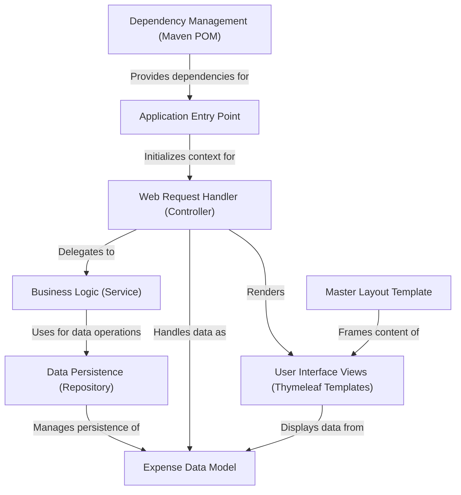

# Tutorial: Budget_Tracer_Web_Java

This project is a *simple web application* called **Expense Tracker**, built with *Java* and the *Spring Boot framework*.
It allows users to **manage their personal expenses** by providing features to *add new expenses*, *view a list of all expenses*, *edit existing ones*, and *delete* them.
The user interface is created using **Thymeleaf templates**, making it easy to see and interact with expense data.

**Source Repository:** [https://github.com/AnshKumarTripathi/Budget_Tracer_Web_Java](https://github.com/AnshKumarTripathi/Budget_Tracer_Web_Java)

## Chapters

1. [Web Request Handler (Controller)](01_web_request_handler__controller_.md)
2. [User Interface Views (Thymeleaf Templates)](02_user_interface_views__thymeleaf_templates_.md)
3. [Expense Data Model](03_expense_data_model.md)
4. [Business Logic (Service)](04_business_logic__service_.md)
5. [Data Persistence (Repository)](05_data_persistence__repository_.md)
6. [Master Layout Template](06_master_layout_template.md)
7. [Application Entry Point](07_application_entry_point.md)
8. [Dependency Management (Maven POM)](08_dependency_management__maven_pom_.md)

---

Generated by [AI Codebase Knowledge Builder](https://github.com/The-Pocket/Tutorial-Codebase-Knowledge)